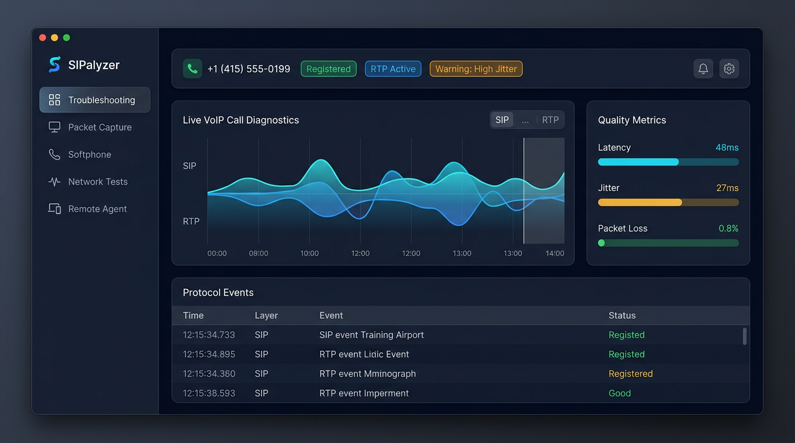
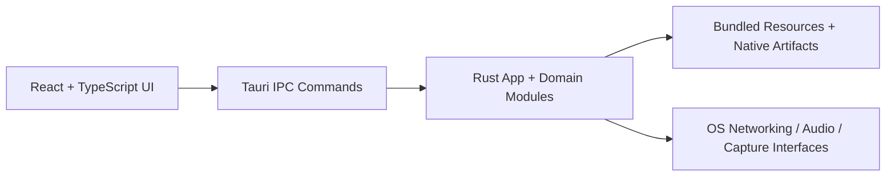

# SIPalyzer

<p align="center">
  <strong>The desktop command center for VoIP diagnostics.</strong><br />
  Registration, packet forensics, live call operations, and guided troubleshooting in one operator workflow.
</p>

<p align="center">
  
  
  
  
</p>

<p align="center">
  <a href="#quick-start"><strong>Quick Start</strong></a> ·
  <a href="#core-capabilities"><strong>Capabilities</strong></a> ·
  <a href="#architecture"><strong>Architecture</strong></a> ·
  <a href="#build-test-and-quality-gates"><strong>Quality Gates</strong></a>
</p>

---

## What SIPalyzer Is

SIPalyzer is an operator-grade desktop workstation for SIP and network troubleshooting. It unifies registration testing, live calling, packet capture, forensic analysis, and guided diagnostics in one toolchain so teams can move from symptom to root cause faster and with less context switching.

Most VoIP incidents are not blocked by a lack of data; they are blocked by fragmented workflows. SIPalyzer closes that gap by connecting call operations and packet-level evidence in a single investigation loop.

**Outcome:** faster triage, fewer blind escalations, and clearer incident handoffs.

## Hero Visual



From alert to packet evidence to diagnosis - all within one desktop surface.

## Core Capabilities

- **Guided troubleshooting**: Guardrail-tested decision support to standardize diagnosis.
- **SIP registration operations**: Register/unregister flows, validation, and repeatable test runs.
- **Packet capture and forensics**: Live capture/import workflows with protocol-focused analysis.
- **Softphone and fax workflows**: Real-time call/media operations and fax center functionality.
- **Network diagnostics suite**: Connectivity and path diagnostics for practical VoIP triage.
- **Remote agent and relay surfaces**: Remote collection and support features for distributed operations.

## Who This Is For

- VoIP support and escalation engineers
- QA teams validating SIP/media behavior across environments
- NOC and operations teams handling production incidents
- Network engineers diagnosing path, DNS, NAT, and signaling interactions

## Quick Start

Get running in minutes:

### Prerequisites

- Node.js 20+
- npm 10+
- Rust toolchain (`rustup`, `cargo`)
- Platform build prerequisites for Tauri (macOS/Windows/Linux)

### Install

```bash
git clone <your-repo-url>
cd testtool
npm install
```

### Run web development mode

```bash
npm run dev
```

### Run desktop development mode

```bash
npm run tauri:dev
```

## Architecture

SIPalyzer uses a desktop-first architecture with a React/TypeScript frontend and a Rust/Tauri backend command layer.

### Technical Stack

- **UI**: React 18, TypeScript, Vite, Tailwind
- **State and async data**: Zustand, TanStack Query/Table
- **Desktop runtime**: Tauri 2
- **Backend command surface**: Rust modules for packet capture, network tests, softphone, remote workflows
- **Bundled resources**: Go toolchain, agent runtime assets, speech model resources

### System Flow



### Architecture Notes

- Tauri build config lives in `src-tauri/tauri.conf.json`.
- Rust workspace and app crates live under `src-tauri/`.
- Frontend feature/tool surfaces are organized under `src/`.
- Validation and release scripts are centralized in `scripts/`.

## Build, Test, and Quality Gates

### Frontend checks

```bash
npm run typecheck
npm run test
npm run build
```

### Rust checks

```bash
npm run check:rust
npm run check:rust:app
```

### End-to-end hygiene gate

```bash
npm run hygiene
```

### Release build path

```bash
npm run tauri:run
```

## Additional Operational Commands

- `npm run tauri:dev:no-watch`: no-watch desktop dev mode
- `npm run test:packet-fidelity`: packet fidelity checks
- `npm run check:os-parity`: OS parity checks
- `npm run test:troubleshooting`: troubleshooting engine guardrails
- `npm run setup:go-toolchain`: prepare bundled Go toolchain resources
- `npm run ensure:native-artifacts`: verify/fetch native artifacts as needed
- `npm run validate:release-bundle`: bundle/resource validation before release

## Platform Support

Active rollout track:

- **Phase 1**: macOS + Windows
- **Phase 2**: Linux completion

Configured bundle targets:

- macOS (`app`, `dmg`)
- Windows (`nsis`)
- Linux (`deb`, `rpm`, `appimage`)

See `docs/os-parity-matrix.md` for active portability status.

## Project Structure

```text
.
├── src/                # React UI, tools, views, stores, workflows
├── src-tauri/          # Tauri app, Rust backend, resources, native integration
├── scripts/            # build/validation wrappers and release checks
├── docs/               # architecture notes, parity matrix, troubleshooting docs
└── sipalyzer-relay/    # relay-related package surfaces
```

## Security and Runtime Notes

- Tauri security policies and CSP are defined in `src-tauri/tauri.conf.json`.
- Native/runtime artifacts are validated in release workflows.
- Some diagnostics and capture features require platform-level permissions.

## Contributing

Contributions are welcome. Before opening a PR:

1. run `npm run hygiene`
2. run relevant domain checks (`check:rust`, `test:packet-fidelity`, `check:os-parity`)
3. include screenshots or trace artifacts for user-facing diagnostic changes

## Roadmap Direction

- complete Linux parity surfaces
- continue hardening packet and troubleshooting guardrails
- improve operational UX for high-volume incident handling

---

If your team lives in SIP traces, packet captures, and urgent escalation channels, SIPalyzer is designed to be your single pane of diagnostic truth.
